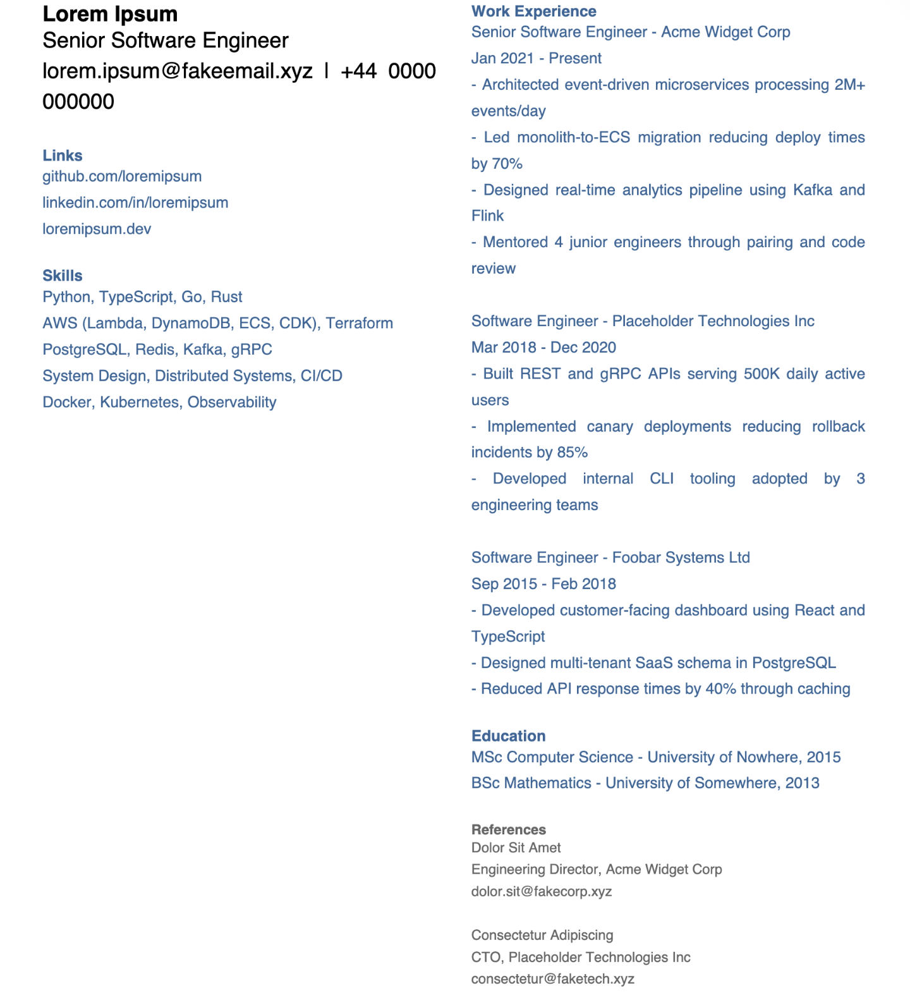

# ResumeForge — README


> 🌐 **Website:** https://resume-forge-cli.web.app/

## Table of Contents
- [About](#about)
- [Setup](#setup)
- [Usage](#usage)
  - [Troubleshooting](#troubleshooting)
- [Testing](#testing)
- [RCSS DSL](#rcss-dsl)
  - [Section identification](#section-identification)
  - [.rcss basics (MVP)](#rcss-basics-mvp)
  - [Example .rcss snippets](#example-rcss-snippets)
- [Examples](#examples)

## About
ResumeForge converts a plain UTF-8 text CV into a styled multi-page A4 PDF using a small CSS-like DSL (.rcss). Supports two layout modes: standard (single-column) and grid (2-column). MVP excludes font-face loading and decorative assets.

## Setup

```bash
python3 -m venv .venv
source .venv/bin/activate
pip install -e .
```

## Usage

```bash
# Render a plain-text CV to styled PDF
resumeforge render --input examples/resume.txt --style examples/valid.rcss --output resume.pdf

# Validate an RCSS style file for syntax errors
resumeforge validate --style examples/valid.rcss

# Print CLI version
resumeforge version
```

### Troubleshooting

**"Unexpected token ... Expected one of: LAYOUT, SECTION"**
Your `.rcss` file has an invalid selector. Only `layout { ... }` and `section[name="..."] { ... }` are valid. Check for typos in the selector keyword.

**"Unexpected token ... Expected one of: SEMICOLON"**
A property declaration is missing its trailing semicolon. Every declaration must end with `;`.

**"RCSS must contain a layout { ... } rule"**
The transformer could not find a `layout` block in your `.rcss` file. Every stylesheet requires one.

**"RCSS must contain at least one section[name=...] rule"**
Your `.rcss` defines a layout but no section rules. Add at least one `section[name="..."] { ... }` block.

**"No sections found in CV text matching the stylesheet"**
The headings in your `.txt` file don't match any `section[name="..."]` values in the stylesheet. Headings must match exactly (case-sensitive, full line).

**"CV text is missing one or more sections defined in the stylesheet"**
Your `.txt` file is missing a heading that the stylesheet expects. Ensure every `section[name="..."]` in the `.rcss` has a corresponding heading line in the CV text.

**"No raw sections to apply rules to"**
The section mapper received no parsed sections to style. This typically means your CV text was empty or contained no lines matching any stylesheet section names.

**"No matching stylesheet rule for one or more sections"**
A section was parsed from the CV text but has no corresponding `section[name="..."]` rule in the stylesheet. Ensure every heading in your `.txt` file has a matching rule in the `.rcss`.

**"column-widths must sum to 100%"**
The percentage values in `column-widths` do not add up to 100. For example, `column-widths: 30% 60%;` totals 90%. Adjust so they equal 100%.

**"column-widths values must be whole numbers with %"**
Each value in `column-widths` must be an integer followed by `%`. Decimal values like `33.3%` and bare numbers like `35` are not allowed.

**"layout property '...' is not valid"**
The layout adapter encountered an unrecognised property in `layout { ... }`. Check for typos. Valid properties: `mode`, `columns`, `column-widths`, `column-gap`, `margins`, `font-family`.

## Testing

```bash
pip install pytest
pytest
```

## RCSS DSL

> Grammar definition: [`src/resumeforge/grammar/rcss.lark`](src/resumeforge/grammar/rcss.lark)

### Section identification
- A section begins at a heading line that matches the pattern ^{HEADING} (a full-line header like: LINKS, WORK EXPERIENCE, EDUCATION).
- A section contains all text from that heading line up to the next heading line or EOF.
- Section selectors in .rcss match the heading text exactly (e.g., section[name="WORK EXPERIENCE"]).

### .rcss basics (MVP)
- File extension: .rcss
- Grid mode supports exactly 2 columns. grid-column must be 1 or 2 for each section in grid mode.

#### Layout properties (in `layout { ... }`)
| Property | Values | Description |
|---|---|---|
| `mode` | `single`, `grid` | Page layout mode |
| `columns` | `2` | Number of columns (grid mode) |
| `column-widths` | e.g. `35% 65%` | Width of each column as percentages (grid mode, must sum to 100%) |
| `column-gap` | e.g. `6mm` | Gap between columns |
| `margins` | e.g. `20mm 18mm 20mm 18mm` | Page margins (top right bottom left) |
| `font-family` | e.g. `"Helvetica"` | Default font (overridden by @font-face) |

#### Font face properties (in `@font-face { ... }`)
| Property | Values | Description |
|---|---|---|
| `font-family` | e.g. `"Carlito"` | Font family name to register |
| `src` | e.g. `"fonts/Carlito-Regular.ttf"` | Path to regular weight TTF |
| `src-bold` | e.g. `"fonts/Carlito-Bold.ttf"` | Path to bold weight TTF |

#### Section properties (in `section[name="..."] { ... }`)

**Style properties** (PDF render mode — applied as PDF state before writing):
| Property | Values | Description |
|---|---|---|
| `font-size` | e.g. `12pt` | Text size |
| `color` | e.g. `#333333` | Text color (hex) |
| `background-color` | e.g. `#f0f0f0` | Section fill color (hex) |

**Write properties** (PDF render mode — control how content is rendered):
| Property | Values | Description |
|---|---|---|
| `align` | `left`, `center`, `right` | Text alignment |
| `line-height` | e.g. `7` | Line height in mm |
| `display` | `block`, `inline` | Block wraps text (multi-line), inline flows horizontally |

**Layout positioning** (grid mode only):
| Property | Values | Description |
|---|---|---|
| `grid-column` | `1`, `2` | Which column to place the section in |
| `padding` | e.g. `8mm` | Inner spacing |
| `width` | e.g. `1fr` | Proportional column width |

### Example .rcss snippets
Single-column (resume-single.rcss)
```css
layout { mode: single; margins: 20mm 18mm 20mm 18mm; }

section[name="HEADER"] {
  padding: 8mm;
  align: center;
}
```

Two-column grid (resume-grid.rcss)
```css
layout { mode: grid; columns: 2; column-widths: 35% 65%; column-gap: 6mm; margins: 20mm 18mm 20mm 18mm; }

/* Place by heading text and explicit column (1 or 2) */
section[name="SIDEBAR"] {
  grid-column: 1;
  padding: 6mm;
  width: 1fr;
}

section[name="MAIN"] {
  grid-column: 2;
  padding: 6mm;
  width: 1fr;
}

section[name="HEADER"] {
  grid-column: 1;
  padding: 8mm;
  align: center;
}
```

## Examples

### Step 1: Write your CV as plain text (`examples/resume.txt`)

```
Lorem Ipsum
Senior Software Engineer
lorem.ipsum@fakeemail.xyz | +44 0000 000000

Links
github.com/loremipsum
linkedin.com/in/loremipsum
loremipsum.dev

Skills
Python, TypeScript, Go, Rust
AWS (Lambda, DynamoDB, ECS, CDK), Terraform
PostgreSQL, Redis, Kafka, gRPC
System Design, Distributed Systems, CI/CD
Docker, Kubernetes, Observability

Work Experience
Senior Software Engineer - Acme Widget Corp
Jan 2021 - Present
- Architected event-driven microservices processing 2M+ events/day
- Led monolith-to-ECS migration reducing deploy times by 70%
- Designed real-time analytics pipeline using Kafka and Flink
- Mentored 4 junior engineers through pairing and code review

Software Engineer - Placeholder Technologies Inc
Mar 2018 - Dec 2020
- Built REST and gRPC APIs serving 500K daily active users
- Implemented canary deployments reducing rollback incidents by 85%
- Developed internal CLI tooling adopted by 3 engineering teams

Software Engineer - Foobar Systems Ltd
Sep 2015 - Feb 2018
- Developed customer-facing dashboard using React and TypeScript
- Designed multi-tenant SaaS schema in PostgreSQL
- Reduced API response times by 40% through caching

Education
MSc Computer Science - University of Nowhere, 2015
BSc Mathematics - University of Somewhere, 2013

References
Dolor Sit Amet
Engineering Director, Acme Widget Corp
dolor.sit@fakecorp.xyz

Consectetur Adipiscing
CTO, Placeholder Technologies Inc
consectetur@faketech.xyz
```

### Step 2: Style it with RCSS (`examples/valid.rcss`)

```css
@font-face { font-family: "Carlito"; src: "examples/fonts/Carlito-Regular.ttf"; src-bold: "examples/fonts/Carlito-Bold.ttf"; }

layout { mode: grid; columns: 2; column-widths: 35% 65%; column-gap: 6mm; margins: 20mm 18mm 20mm 18mm; font-family: "Carlito"; }

section[name="Lorem Ipsum"] {
  font-size: 22pt;
  align: center;
  line-height: 9;
  grid-column: 1;
}

section[name="Links"] {
  color: #336699;
  line-height: 5;
  grid-column: 1;
}

section[name="Skills"] {
  line-height: 5;
  grid-column: 1;
}

section[name="Work Experience"] {
  line-height: 5;
  grid-column: 2;
}

section[name="Education"] {
  line-height: 5;
  grid-column: 2;
}

section[name="References"] {
  color: #555555;
  line-height: 5;
  grid-column: 2;
}
```

### Step 3: Render to PDF

```bash
resumeforge render --input examples/resume.txt --style examples/valid.rcss --output examples/resume.pdf
```

### Result

